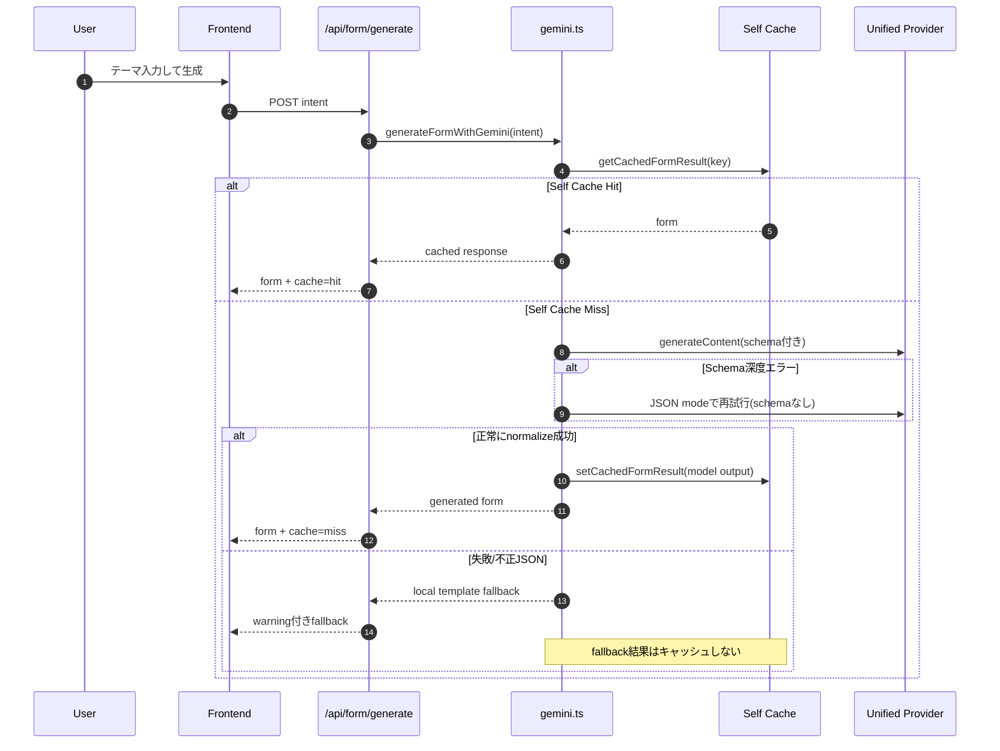

## 1. 全体アーキテクチャ（High Level）

```mermaid
flowchart LR
  U[User\nBrowser / Mobile Web] --> FE[Next.js Frontend\nReact + Dynamic UI]

  FE --> FAPI[/POST /api/form/generate/]
  FE --> AAPI[/POST /api/form/autofill/]
  FE --> PAPI[/POST /api/prompt/generate/]

  subgraph BE["Next.js API Routes (Server)"]
    FAPI --> ORCH[Orchestrator\nlib/server/gemini.ts]
    AAPI --> ORCH
    PAPI --> ORCH

    ORCH --> CACHE[Self Cache\nsqlite / memory]
    CACHE -. hit .-> ORCH

    ORCH --> CCTX[Context Cache Controller\nlib/server/ai/context-cache.ts]
    CCTX --> MC[(Model Context Cache\nVertex/Gemini)]

    ORCH --> PROV[Provider Resolver\nlib/server/ai/provider.ts]
    PROV --> GMD[Gemini API direct\n(API key / AIza...)]
    PROV --> VSTD[Vertex AI Standard\n(project+location+ADC)]
    PROV --> VEXP[Vertex AI Express\n(AQ... key)]

    ORCH --> POLICY[Form Policy JSON\nconfig/form-generation-policy.json]
    ORCH -. fallback .-> LOCAL[Local Template / Local Suggestion]
  end

  ORCH --> RES[JSON Response\nprovider/model/cache/warning]
  RES --> FE
```

## 2. フォーム生成シーケンス


