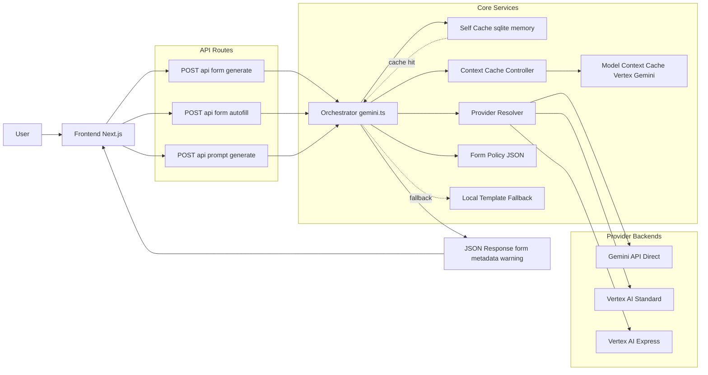
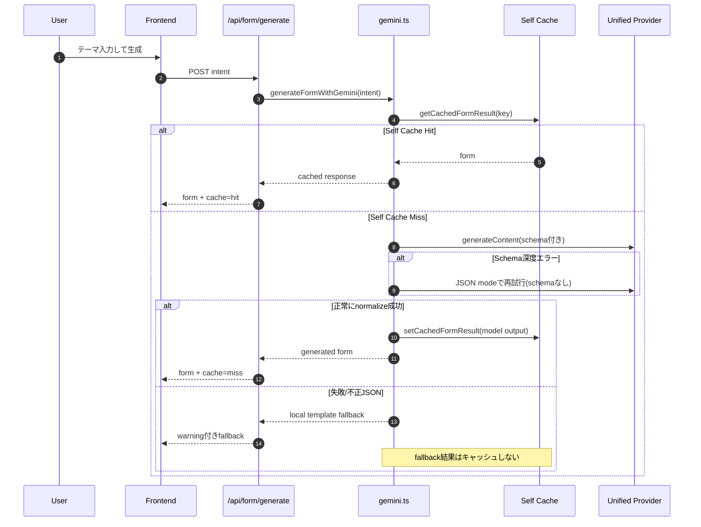

## 1. 全体アーキテクチャ（High Level）

```mermaid
flowchart LR
  U[User]
  FE[Frontend Next.js]

  subgraph API[API Routes]
    FAPI[POST api form generate]
    AAPI[POST api form autofill]
    PAPI[POST api prompt generate]
  end

  subgraph CORE[Core Services]
    ORCH[Orchestrator gemini.ts]
    CACHE[Self Cache sqlite memory]
    CCTX[Context Cache Controller]
    MC[Model Context Cache Vertex Gemini]
    PROV[Provider Resolver]
    POLICY[Form Policy JSON]
    LOCAL[Local Template Fallback]
  end

  subgraph LLM[Provider Backends]
    GMD[Gemini API Direct]
    VSTD[Vertex AI Standard]
    VEXP[Vertex AI Express]
  end

  RES[JSON Response form metadata warning]

  U --> FE
  FE --> FAPI
  FE --> AAPI
  FE --> PAPI

  FAPI --> ORCH
  AAPI --> ORCH
  PAPI --> ORCH

  ORCH --> CACHE
  CACHE -. cache hit .-> ORCH

  ORCH --> CCTX
  CCTX --> MC

  ORCH --> PROV
  PROV --> GMD
  PROV --> VSTD
  PROV --> VEXP

  ORCH --> POLICY
  ORCH -. fallback .-> LOCAL

  ORCH --> RES
  RES --> FE
```

## 2. フォーム生成シーケンス

```mermaid
sequenceDiagram
  autonumber
  participant User as User
  participant FE as Frontend
  participant API as /api/form/generate
  participant Orch as gemini.ts
  participant SCache as Self Cache
  participant Prov as Unified Provider

  User->>FE: テーマ入力して生成
  FE->>API: POST intent
  API->>Orch: generateFormWithGemini(intent)
  Orch->>SCache: getCachedFormResult(key)

  alt Self Cache Hit
    SCache-->>Orch: form
    Orch-->>API: cached response
    API-->>FE: form + cache=hit
  else Self Cache Miss
    Orch->>Prov: generateContent(schema付き)
    alt Schema深度エラー
      Orch->>Prov: JSON modeで再試行(schemaなし)
    end

    alt 正常にnormalize成功
      Orch->>SCache: setCachedFormResult(model output)
      Orch-->>API: generated form
      API-->>FE: form + cache=miss
    else 失敗/不正JSON
      Orch-->>API: local template fallback
      API-->>FE: warning付きfallback
      Note over Orch,SCache: fallback結果はキャッシュしない
    end
  end
```
